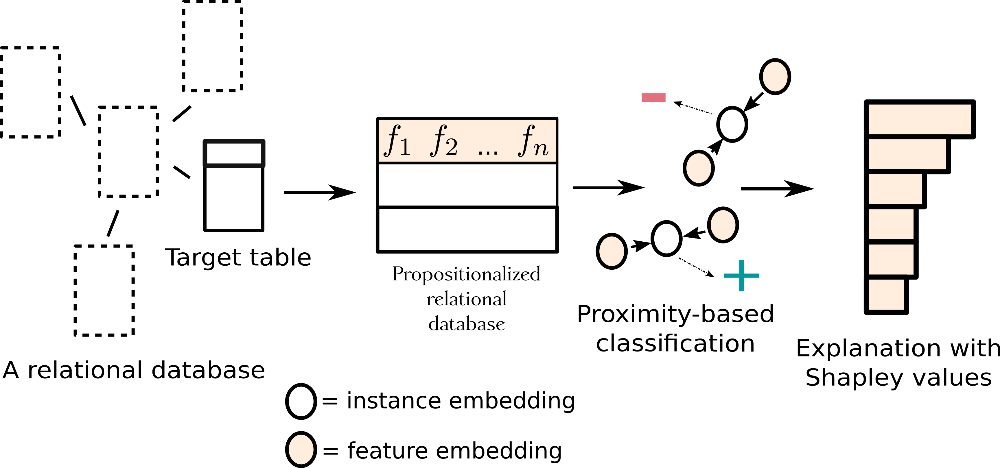

# Propositionalization and Embeddings - two sides of the same coin
Data preprocessing is an important component of machine learning pipelines, which requires ample time and resources. An integral part of preprocessing is data transformation into the format required by a given learning algorithm. This paper outlines some of the modern data processing techniques used in relational learning that enable data fusion from different input data types and formats into a single table data representation, focusing on the propositionalization and embedding data transformation approaches. While both approaches aim at transforming data into tabular data format, they use different terminology and task definitions, are perceived to address different goals, and are used in different contexts. This paper contributes a unifying framework that allows for improved understanding of these two data transformation techniques by presenting their unified definitions, and by explaining the similarities and differences between the two approaches as variants of a unified complex data transformation task. In addition to the unifying framework, the novelty of this paper is a unifying methodology combining propositionalization and embeddings, which benefits from the advantages of both in solving complex data transformation and learning tasks. We present two efficient implementations of the unifying methodology: an instance-based PropDRM approach, and a feature-based PropStar approach to data transformation and learning, together with their empirical evaluation on several relational problems. The results show that the new algorithms can outperform existing relational learners and can solve much larger problems.

https://arxiv.org/abs/2006.04410



If you use this code, please cite:

```
@Article{Lavrač2020,
author={Lavra{\v{c}}, Nada
and {\v{S}}krlj, Bla{\v{z}}
and Robnik-{\v{S}}ikonja, Marko},
title={Propositionalization and embeddings: two sides of the same coin},
journal={Machine Learning},
year={2020},
month={Jul},
day={01},
volume={109},
number={7},
pages={1465-1507},
abstract={Data preprocessing is an important component of machine learning pipelines, which requires ample time and resources. An integral part of preprocessing is data transformation into the format required by a given learning algorithm. This paper outlines some of the modern data processing techniques used in relational learning that enable data fusion from different input data types and formats into a single table data representation, focusing on the propositionalization and embedding data transformation approaches. While both approaches aim at transforming data into tabular data format, they use different terminology and task definitions, are perceived to address different goals, and are used in different contexts. This paper contributes a unifying framework that allows for improved understanding of these two data transformation techniques by presenting their unified definitions, and by explaining the similarities and differences between the two approaches as variants of a unified complex data transformation task. In addition to the unifying framework, the novelty of this paper is a unifying methodology combining propositionalization and embeddings, which benefits from the advantages of both in solving complex data transformation and learning tasks. We present two efficient implementations of the unifying methodology: an instance-based PropDRM approach, and a feature-based PropStar approach to data transformation and learning, together with their empirical evaluation on several relational problems. The results show that the new algorithms can outperform existing relational learners and can solve much larger problems.},
issn={1573-0565},
doi={10.1007/s10994-020-05890-8},
url={https://doi.org/10.1007/s10994-020-05890-8}
}

```

# Repo description
The repo contains the code required to reproduce the experiments from the original paper. Note, however, that cluster-level infrastructure is needed to obtain enough repetitions, so use at own risk. Minimal working examples are provided next.

## Installation
For full functionality, one needs:
1. starspace binary (included in this repo, re-complile if necessary via https://github.com/facebookresearch/StarSpace)
2. pip install -r requirements.txt
3. query_predict binary (for efficient predictions)

And that's it!
## Minimal usecase
To run 10fCV for some of the well known data sets, just run:

```
python propStar.py
```

This code reads from two files:
1. datasets.txt, containing info on target table and attribute (in sql_data folder)
2. variable_types.txt, the types to be accounted for during feature extraction

The code will output lines in form of RESULT_LINE ...., which, when e.g., grepped from the output, can be used to assess the algorithm's performance. A note on hyperparameters:


```
usage: propStar.py [-h] [--learner LEARNER] [--learning_rate LEARNING_RATE]
                   [--epochs EPOCHS] [--dropout DROPOUT]
                   [--num_features NUM_FEATURES] [--hidden_size HIDDEN_SIZE]
                   [--negative_samples_limit NEGATIVE_SAMPLES_LIMIT]
                   [--negative_search_limit NEGATIVE_SEARCH_LIMIT]
                   [--representation_type REPRESENTATION_TYPE]

optional arguments:
  -h, --help            show this help message and exit
  --learner LEARNER
  --learning_rate LEARNING_RATE
                        Learning rate of starspace
  --epochs EPOCHS       Number of epochs
  --dropout DROPOUT     Dropout rate
  --num_features NUM_FEATURES
                        Number of features
  --hidden_size HIDDEN_SIZE
                        Embedding dimension
  --negative_samples_limit NEGATIVE_SAMPLES_LIMIT
                        Max number of negative samples
  --negative_search_limit NEGATIVE_SEARCH_LIMIT
                        Negative search limit (see starspace docs for extensive
                        description)
  --representation_type REPRESENTATION_TYPE
                        Type of representation and weighting. tfidf or binary,
                        also supports scikit's implementations (ordered patterns)

```

Example use with starspace:
```
python propStar.py --learner starspace
```
Example use with DRM
```
python propStar.py --learner DRM
```

## Use with own data
Current implementation works with sql dumps, as can be obtained directly from e.g., https://relational.fit.cvut.cz/

## Baseline methods
The other baselines are implemented as part of pyRDM package, found here:
https://github.com/xflows/rdm

## Looking for ideas on what to try?
This study merely opened a way to many potentially interesting research directions. Some ideas:
1. Explore how other KG embedding methods behave when embedding logic structures
2. Is there potential for hyperbolic embeddings in such scenarios
3. Scale up extraction of features even further via e.g., FPGrowth or similar
4. Consider longer triplet paths, spanning multiple tables
5. Include some form of supervised feature ranking directly into the feature construction process (e.g., L1-based prunning)
